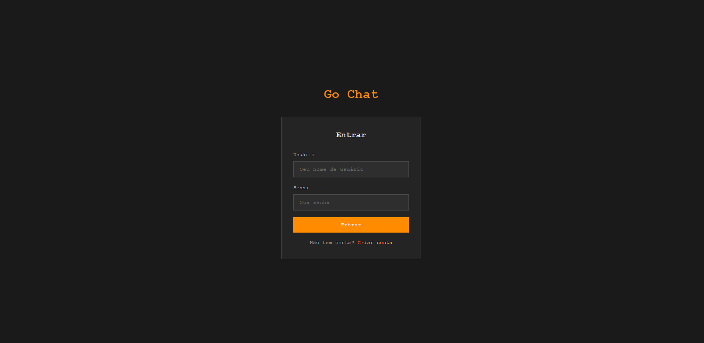
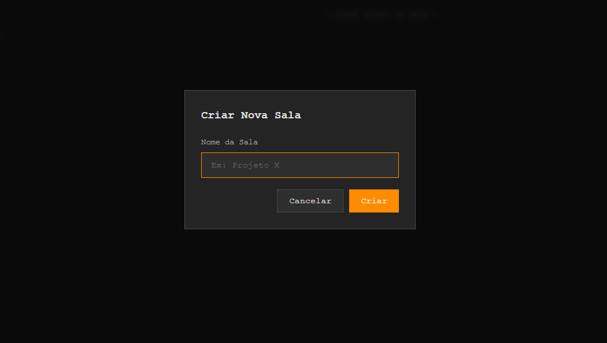
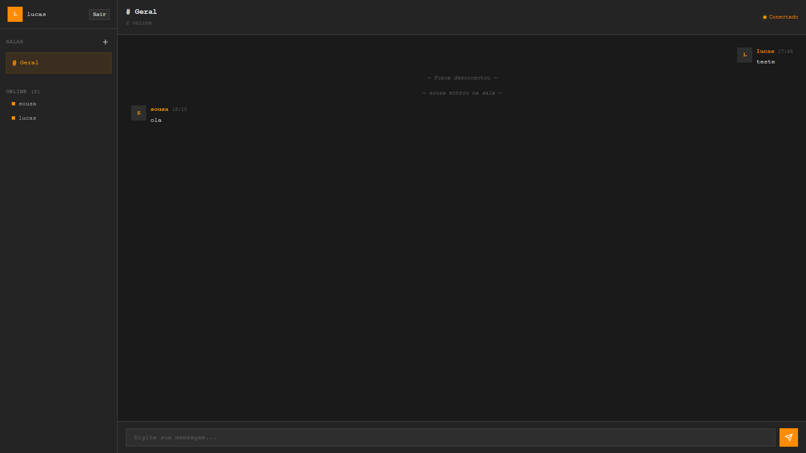

# Go Chat — Chat em Tempo Real com WebSockets

<p align="center">
  <strong>Sistema de chat em tempo real construído em Go, utilizando WebSockets, Clean Architecture, MySQL e autenticação JWT.</strong>
</p>

---

## Índice

- [Sobre o Projeto](#-sobre-o-projeto)
- [Tecnologias](#-tecnologias)
- [Arquitetura](#-arquitetura)
- [Estrutura do Projeto](#-estrutura-do-projeto)
- [Pré-requisitos](#-pré-requisitos)
- [Como Rodar](#-como-rodar)
- [API Reference](#-api-reference)
- [Protocolo WebSocket](#-protocolo-websocket)
- [Frontend](#-frontend)
- [Testes](#-testes)
- [Sugestões de Melhoria](#-sugestões-de-melhoria)

---

## Sobre o Projeto

Go Chat é um sistema de chat em tempo real que suporta múltiplas salas,
autenticação de usuários, persistência de mensagens e uma interface web moderna.
O projeto segue os princípios da **Clean Architecture**, garantindo separação
clara de responsabilidades e testabilidade.

### Funcionalidades

| Funcionalidade                        | Status |
| ------------------------------------- | ------ |
| Múltiplas salas de chat               | ✅     |
| Broadcast em tempo real via WebSocket | ✅     |
| Autenticação JWT (registro/login)     | ✅     |
| Persistência de mensagens (MySQL)     | ✅     |
| Histórico de mensagens por sala       | ✅     |
| Lista de usuários online por sala     | ✅     |
| Notificações de entrada/saída         | ✅     |
| Detecção de desconexão (ping/pong)    | ✅     |
| Rate limiting por IP                  | ✅     |
| Reconexão automática (frontend)       | ✅     |
| Frontend responsivo com dark theme    | ✅     |
| Graceful shutdown                     | ✅     |

---

## Tecnologias

| Tecnologia              | Uso                 |
| ----------------------- | ------------------- |
| **Go 1.21+**            | Linguagem principal |
| **gorilla/websocket**   | Protocolo WebSocket |
| **gorilla/mux**         | Roteamento HTTP     |
| **go-sql-driver/mysql** | Driver MySQL        |
| **golang-jwt/jwt**      | Autenticação JWT    |
| **golang.org/x/crypto** | Hashing bcrypt      |
| **google/uuid**         | Geração de UUIDs    |
| **HTML/CSS/JS**         | Frontend            |

---

## Arquitetura

O projeto segue a **Clean Architecture**, organizado em 4 camadas:

```
┌─────────────────────────────────────────────────────┐
│                   Delivery Layer                     │
│         (HTTP Handlers, WebSocket, Middleware)        │
├─────────────────────────────────────────────────────┤
│                   Use Case Layer                     │
│          (AuthUseCase, RoomUseCase, MessageUseCase)   │
├─────────────────────────────────────────────────────┤
│                   Domain Layer                       │
│       (Entities, Repository Interfaces, Errors)       │
├─────────────────────────────────────────────────────┤
│                Infrastructure Layer                   │
│           (MySQL, JWT, Bcrypt, Migrations)            │
└─────────────────────────────────────────────────────┘
```

### Hub Pattern (WebSocket)

O **Hub** é o gerenciador central de conexões. Utiliza **channels** do Go para
comunicação thread-safe:

```
                ┌──────────┐
 register ────→ │          │
                │   Hub    │ ──→ broadcastToRoom()
unregister ───→ │          │
                │ (gorout) │
 broadcast ───→ │          │
                └──────────┘
                     │
          ┌──────────┼──────────┐
          │          │          │
     ┌────┴────┐ ┌───┴────┐ ┌──┴─────┐
     │Client A │ │Client B│ │Client C│
     │ R/W pump│ │ R/W p. │ │ R/W p. │
     └─────────┘ └────────┘ └────────┘
```

Cada **Client** possui duas goroutines:

- **ReadPump**: lê mensagens do WebSocket e envia para o Hub
- **WritePump**: lê do channel interno e escreve no WebSocket

---

## Estrutura do Projeto

```
go-chat/
├── cmd/
│   └── server/
│       └── main.go                    # Entry point
├── internal/
│   ├── domain/
│   │   ├── entity.go                  # User, Room, Message
│   │   ├── repository.go             # Interfaces de repositório
│   │   └── errors.go                  # Erros de domínio
│   ├── usecase/
│   │   ├── auth_usecase.go           # Registro, login, JWT
│   │   ├── room_usecase.go           # CRUD de salas
│   │   └── message_usecase.go        # Salvar/buscar mensagens
│   ├── delivery/
│   │   ├── http/
│   │   │   ├── handler.go            # REST endpoints
│   │   │   ├── middleware.go          # Auth, rate limit, CORS
│   │   │   └── response.go           # JSON response helpers
│   │   └── websocket/
│   │       ├── hub.go                 # Hub central
│   │       ├── client.go             # Client + read/write pumps
│   │       ├── handler.go            # WS upgrade handler
│   │       └── message.go            # Tipos de mensagem WS
│   └── infrastructure/
│       ├── mysql/
│       │   ├── connection.go          # Pool de conexões
│       │   ├── user_repository.go     # Implementação UserRepo
│       │   ├── room_repository.go     # Implementação RoomRepo
│       │   └── message_repository.go  # Implementação MessageRepo
│       ├── auth/
│       │   ├── jwt.go                 # Geração/validação JWT
│       │   └── hasher.go             # Bcrypt hashing
│       └── migration/
│           └── schema.sql             # Schema do banco
├── web/
│   ├── index.html                     # Frontend
│   ├── style.css                      # Estilos
│   └── app.js                         # Lógica WebSocket
├── tests/
│   ├── hub_test.go                    # Testes do Hub
│   └── usecase_test.go               # Testes dos Use Cases
├── .env.example                       # Template de config
├── go.mod
└── README.md
```

---

## Pré-requisitos

- **Go** 1.21 ou superior
- **MySQL** 8.0 ou superior
- **Git**

---

## Como Rodar

### 1. Clone o repositório

```bash
git clone https://github.com/CiceroLucas/go-chat.git
cd go-chat
```

### 2. Configure o banco de dados

Crie o banco de dados MySQL:

```sql
CREATE DATABASE go_chat;
```

Ou execute o script completo:

```bash
mysql -u {db_user} -p{db_password} < internal/infrastructure/migration/schema.sql
```

### 3. Configure as variáveis de ambiente

```bash
cp .env.example .env
```

Configurações padrão:

```env
DB_HOST=localhost
DB_PORT=3306
DB_USER=
DB_PASS=
DB_NAME=go_chat
JWT_SECRET=
SERVER_PORT=8080
```

### 4. Instale as dependências

```bash
go mod download
```

### 5. Execute o servidor

```bash
go run cmd/server/main.go
```

Saída esperada:

```
Iniciando Go Chat Server...
Conectado ao MySQL com sucesso
Migrations executadas com sucesso
Usuário sistema criado
Sala 'Geral' disponível
Hub iniciado — aguardando conexões...
Servidor rodando em http://localhost:8080
WebSocket disponível em ws://localhost:8080/ws
Frontend disponível em http://localhost:8080
```

### 6. Acesse o frontend

Abra o navegador em: **http://localhost:8080**

---

## API Reference

### Autenticação

#### POST `/api/auth/register`

```json
// Request
{
  "username": "lucas",
  "email": "lucas@email.com",
  "password": "123456"
}

// Response (201)
{
  "success": true,
  "data": {
    "token": "eyJhbGciOiJIUzI1NiIs...",
    "user": {
      "id": "uuid",
      "username": "lucas",
      "email": "lucas@email.com",
      "created_at": "2026-05-02T17:00:00Z"
    }
  }
}
```

#### POST `/api/auth/login`

```json
// Request
{ "username": "lucas", "password": "123456" }

// Response (200)
{ "success": true, "data": { "token": "...", "user": {...} } }
```

### Salas (Autenticação obrigatória)

| Método | Endpoint                  | Descrição              |
| ------ | ------------------------- | ---------------------- |
| GET    | `/api/rooms`              | Listar todas as salas  |
| POST   | `/api/rooms`              | Criar nova sala        |
| GET    | `/api/rooms/:id/messages` | Histórico de mensagens |

Header obrigatório: `Authorization: Bearer <token>`

### Health Check

```
GET /api/health → { "success": true, "data": { "status": "healthy" } }
```

---

## Protocolo WebSocket

### Conexão

```
ws://localhost:8080/ws?token=<JWT_TOKEN>
```

### Tipos de Mensagem

| Tipo           | Direção            | Descrição                |
| -------------- | ------------------ | ------------------------ |
| `join_room`    | Cliente → Servidor | Entrar em uma sala       |
| `leave_room`   | Cliente → Servidor | Sair de uma sala         |
| `message`      | Bidirecional       | Enviar/receber mensagem  |
| `room_history` | Cliente → Servidor | Solicitar histórico      |
| `system`       | Servidor → Cliente | Notificação do sistema   |
| `user_list`    | Servidor → Cliente | Lista de usuários online |
| `error`        | Servidor → Cliente | Mensagem de erro         |

### Exemplos

**Entrar em uma sala:**

```json
{ "type": "join_room", "room_id": "uuid-da-sala" }
```

**Enviar mensagem:**

```json
{ "type": "message", "room_id": "uuid-da-sala", "content": "Olá!" }
```

**Mensagem recebida:**

```json
{
  "type": "message",
  "room_id": "uuid-da-sala",
  "content": "Olá!",
  "username": "lucas",
  "user_id": "uuid-do-usuario",
  "timestamp": "2026-05-02T17:00:00Z"
}
```

---

## Frontend

Interface moderna construída com HTML, CSS e JavaScript puro:

- **Dark Theme** com efeitos de glassmorphism
- **Responsivo** com suporte a mobile
- **Auto-reconexão** WebSocket com backoff exponencial
- **Sessão persistente** via localStorage

### Screenshots

 _Tela de Autenticação_

 _Modal de Criação de Sala_

 _Interface Principal do Chat_

### Funcionalidades da UI

- Tela de login/registro
- Sidebar com lista de salas e usuários online
- Área de chat com histórico de mensagens
- Criação de novas salas via modal
- Indicador de status de conexão
- Notificações toast

---

## Testes

Execute todos os testes:

```bash
go test ./tests/... -v
```

### Cobertura dos testes:

| Componente      | Testes                                                 |
| --------------- | ------------------------------------------------------ |
| Hub             | Criação, tipos de mensagem, serialização, concorrência |
| Auth UseCase    | Registro, login, duplicação, validação                 |
| JWT Service     | Geração, validação, expiração, chave diferente         |
| Hasher          | Hash, comparação correta e incorreta                   |
| Room UseCase    | Criar, duplicar, listar, sala padrão                   |
| Message UseCase | Salvar, validar, histórico, paginação                  |
